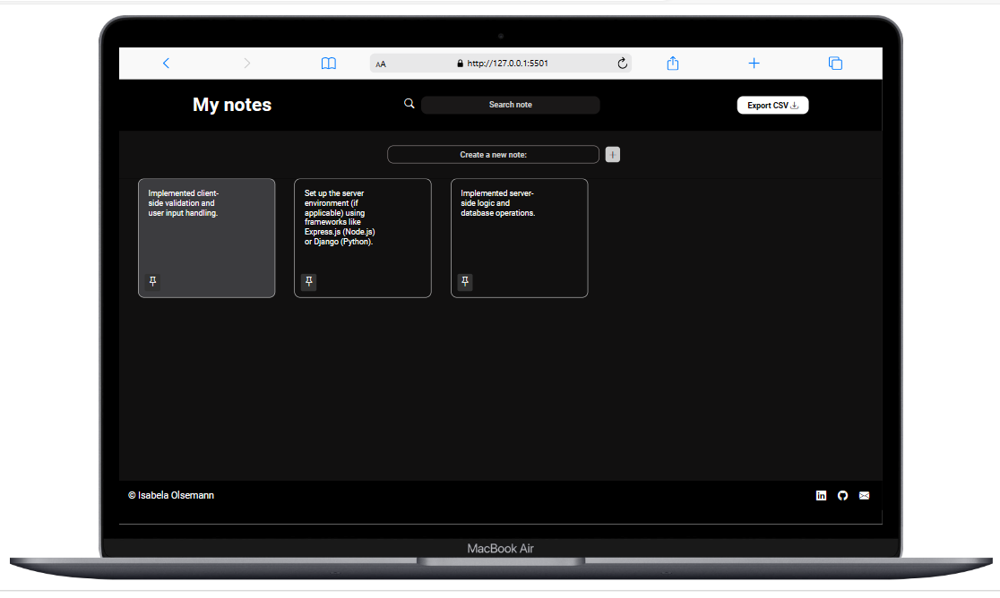

<h1 align="center">Notes</h1>

  <a href="#-project">Project</a>&nbsp;&nbsp;&nbsp;|&nbsp;&nbsp;&nbsp;
  <a href="#-technologies-used">Technologies</a>&nbsp;&nbsp;&nbsp;|&nbsp;&nbsp;&nbsp;
  <a href="#-preview">Preview</a>

  

## 💻 Project
The Notes project is a web application designed to help users manage their notes effectively. It provides features to create, edit, and delete notes, along with search functionality to find specific notes quickly. The application uses local storage to store notes, ensuring they persist even when the user closes the browser.

## ✨ Technologies used:
- HTML
- CSS
- JavaScript

## ⚙️ Features
- Create new notes with custom content
- Edit existing notes to update their content
- Delete unwanted notes to declutter the interface
- Pin notes to keep important ones at the top
- Search functionality to find notes by their content
- Export notes as a CSV file for backup or sharing

## 🔗 Preview
<a href="https://isabelaolsemann.github.io/Notes/" target="_blank">View Notes</a>

---
This project was developed by Isabela Olsemann as part of an exercise in Matheus Battisti's Hora de Codar course.
